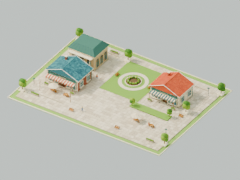
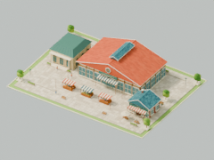

# T08 / #10：街角初成 Lv.1–2

实现提交：`3767d39`。固定审查起点：`ee73f7b`。2026-09-22 开始前已读取线上 #10 正文及原生 blocker；#8 为 CLOSED。此票仅交付 Lv.1–2，后续阶段和完整图鉴继续由各自 ticket 负责。

## 交付

- Lv.1：瓦片咖啡店、合作商店、石材储蓄所；窗框、橱窗、门把手、檐口、落水管、花箱、外摆及小花园。
- Lv.2：独立的大屋顶市场、玻璃屋脊采光带、储蓄所侧翼、咖啡店、三组带结构支撑的雨棚摊位、连贯铺装和灯串。没有沿用旧三级的精确可见区间。
- `modeling/finance-levels.json` 同时供前端选择和 GLB 验证使用。每级只加载自己的 GLB；灯光、灯晕和活动顾客由同一单元挂载、更新和释放。取消/过期下载不会挂回旧等级。
- 正式财务当前等级驱动模型；草稿和历史峰值不驱动。未登录/无授权只显示中性 Lv.1；本票尚未交付的 Lv.3–10 明确显示待建提示及 Lv.1 街景。
- 店招、窗光、檐下灯和灯串遵守昼夜/灯光开关；独立视觉时钟遵守暂停、减少动态和后台状态，不推进财务或真实行程。
- 桌面账本移到右侧，可收起看城市。收起保留草稿和退出保护；不隐藏原生确认弹窗。窄屏沿用底部面板及收起入口。

## 模型与保留边界

[重导入报告](t08/model-validation.json) 对实际压缩 GLB 做独立重导入。Lv.1 / Lv.2 均为 60×44 m，最高分别 8.301 / 12.710 m，低于 60 m；活动顾客实测约 1.7 m。三角形分别 164,882 / 185,028；文件分别 1,058,924 / 1,099,692 bytes。每次仅一个等级活动，3 盏无投影局部点光源，2 / 3 位活动顾客。

原 `family-city.glb`（含已批准 v0.4 繁荣几何）、原 `city-lighting.glb`、`mobility.glb` 及受保护 Sites 文件字节不变：[SHA-256 对照](t08/preserved-assets.json)。基础城市包仍携带旧财务参考网格，运行时隐藏且不参与财务更新；新等级的几何/效果不预载全部级别。后续全城资源优化属于 T15。

新的 `city-lighting-v1.glb` 仅移除 4 个旧财务灯芯，82 个其他灯位与旧资源逐项相同；全城财务补光也移入等级单元。[灯光重导入报告](t08/lighting-validation.json)。其他区块、车辆暖窗、机场、高铁和原有设施可见性规则保持不变。

重现命令（本机 Blender 4.5.7 LTS）：

```sh
npm run model:finance
npm run model:verify-finance
npm run model:lighting
npm run model:verify-lighting
npm run model:finance-studies
```

[Lv.1 白天南面](t08/level-1-south-day.png) · [北面](t08/level-1-north-day.png) · [夜晚南面](t08/level-1-south-night.png) · [北面](t08/level-1-north-night.png)

[Lv.2 白天南面](t08/level-2-south-day.png) · [北面](t08/level-2-north-day.png) · [夜晚南面](t08/level-2-south-night.png) · [北面](t08/level-2-north-night.png)

无等级文字、地块约 200 px 的缩图，两级的分散低层街角与大屋顶市场轮廓仍可区分：

 

## 本地到真实云端验收

所有浏览器操作都在 in-app browser。测试账号为隔离家庭管理员 `family-city-t08-015ba47e@example.com`，家庭 `a3318304-bfc3-45c7-97d9-8c4d14564192`；没有向真实家庭账写入数据。凭据只在忽略的 `.env.t08-test`，不包含在证据中。

1. 从空云账登录，展示 Lv.1、无历史记录。
2. 17:43:28（北京时间）通过表单保存 `T08 街角储蓄` 9,999.99 元，当前 Lv.1，距离 Lv.2 差 0.01 元。
3. 编辑 10,000 元草稿时仍显示已保存 Lv.1/原街角。17:51:16 明确保存后变为 Lv.2/大屋顶市场，2 位街角顾客替换为 3 位市场顾客。
4. 昼夜、相反视角均检查。暂停后在两次读取之间顾客位置及视觉秒数完全一致（141.885），暖灯继续亮；关灯后 night=0，恢复后 night=1。
5. 17:58:14 保存降回 9,999.99 元，当前建筑和氛围恢复 Lv.1，只剩对应 2 位顾客；历史峰值仍为 10,000 元/Lv.2。刷新再次读回同样结果。
6. 编辑草稿 12,345.67，收起账本后切换模块仍弹出未保存提醒；继续编辑并展开，输入完整保留；恢复原金额结束该未保存测试，未新增历史。
7. 390×844 检查：页面宽/滚动宽均 390，面板宽/滚动宽均 358，展开/收起可用。工具的窄屏截图出现缩放限制，因此只据 DOM 尺寸与操作记录判断此项，不声称进行了完整设备实测。

[浏览器状态与资源证据](t08/browser-evidence.json) · [公开 `get_finance_book` 回读](t08/cloud-readback.json) · [Lv.1 日间并排账本](t08/browser-level-1-day.png) · [Lv.1 夜景](t08/browser-level-1-night.png) · [反向夜景](t08/browser-level-1-rear-night.png) · [Lv.2 白天](t08/browser-level-2-day.png)

1280×720、DPR 上限 1.5 的本机 IAB 基线：Lv.2 白天约 60.0 FPS / 138 calls / 1,859,109 renderer triangles；夜晚约 59.7 FPS / 161 calls / 1,871,846 triangles，172 geometries / 22 textures；回到 Lv.1 夜晚约 59.9 FPS / 161 calls / 1,832,594 triangles，171 geometries / 22 textures。renderer 总数包含全城、AO/阴影/后处理，不等同单个资产三角形；以上为特定设备短时采样，不承诺所有设备达到相同帧率。切换后资源数未持续增加。

## 自动验证

- 红→绿：精确 Lv.1/Lv.2 资源映射测试首先因 `modelReady=false` 失败；实现后通过。实际 GLB 验证首先因缺少资源失败，之后生成、重导入和尺寸检查通过。
- Three.js 场景边界测试：等级切换清除旧灯光/顾客并释放几何材质；暂停仅停止顾客；过期响应和卸载后的响应会释放且不再挂载。
- `npm test`：65/65。
- `npm run typecheck`：通过。
- `npm run build`：通过；保留原有 Three.js 主包较大的提示；Sites 三个必需输出存在。
- `npm run test:sites`：4/4。
- `git diff --check`：通过。
- 本地与生产 IAB 控制台均无错误/警告。

## 生产验收

[Vercel 部署成功](https://vercel.com/jojotechs-projects/3d-home-dashboard/BiCgPx5gUJu6QQYKq4XLGB6dsQfq)，对应实现 `3767d39`。正式域名 [3d-home-dashboard.vercel.app](https://3d-home-dashboard.vercel.app/) 实际加载 `/assets/index-CubaQ5Ok.js`，与本地验证构建相同。

- 使用上述隔离管理员正常登录生产页；18:25:10（北京时间）明确保存 10,000 元，当前变 Lv.2。刷新后仍为 Lv.2，大屋顶市场与 3 位活动顾客正常加载。
- 实际检查市场夜景和相反角度：[正面](t08/browser-level-2-night.png)、[背面](t08/browser-level-2-rear-night.png)。1280×720 生产页短时采样约 57.6 FPS，172 geometries / 22 textures。
- 在 Lv.2 退出登录后，`data-finance-level` 清除，场景回到中性 Lv.1/2 位顾客。再次通过正常登录进入账本，恢复真实 Lv.2。
- 18:28:46 保存降回 9,999.99 元，恢复 Lv.1/2 位顾客，几何资源回到 171、纹理仍为 22，短时约 58.7 FPS。最后刷新再次显示当前 Lv.1、历史峰值 Lv.2：[生产回读截图](t08/production-downgrade.png)。
- 最终公开 `get_finance_book` 回读为版本 5、5 条真实历史、当前 `999999` 分，历史峰值 `1000000` 分；没有重复记录或草稿测试写入。详见 [cloud-readback.json](t08/cloud-readback.json)。
- 已恢复自动跟随北京时间，清除临时 viewport override；保留生产页面供查看。正式页与本地均未使用模拟持久化或后台直接写入财务结果。

## Standards

硬性规范：未发现违反项目标准的问题。财务当前等级仍由已保存余额决定；独立 GLB 保留原几何资产，其他区域未扩大变更。灯光、顾客与材质由 `FinanceDistrict` 统一管理，切换及卸载会释放资源，符合视觉简报的生命周期要求。

结构建议：无可行动项。资源清单集中定义，财务场景与账本职责分离；收起账本保留组件和草稿，未引入重复状态来源或无需求抽象。

本次发现 0 项；审查范围 `ee73f7b…3767d39`。

## Spec

无待修复项，未发现遗漏或越界。已读取 #10 实时正文（无评论），并查看 GLB 重导入昼夜、南北视角、缩图及浏览器截图。Lv.1 的瓦片街角、外摆与 Lv.2 的大屋顶市场、储蓄所、雨棚摊位符合要求，约 200 px 下轮廓仍清晰可辨。

代码按当前已保存等级选择独立 GLB，建筑、灯光和顾客统一切换与释放；暂停保留静态照明。地块、人物比例及旧资产保留符合规格。Lv.3–10 和完整图鉴属后续票。发现 0 项。
