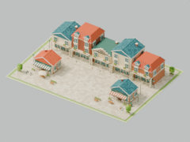
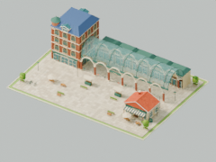

# T09 / #11：邻里商街 Lv.3–4

2026-09-29 开始前读取 GitHub #11 实时正文、评论与原生 blocked_by；唯一前置 #10 已关闭。固定审查起点 `41e5652`。此票不扩展 Lv.5–10 或完整图鉴。

## 交付内容

- Lv.3：五栋相连的两三层底商，开放骑楼、阳台栏杆、花槽、瓦屋顶、老虎窗与阶梯山墙；各店入口错位、实体悬挑招牌支架、街道挂旗、暖橱窗与背面服务门窗，前街有咖啡店、日用店、外摆、自行车及包裹收取柜。
- Lv.4：独立红砖转角楼、铜顶角塔、砖缝与窗格；连续的实体拱券、柱墩和半透明玻璃桶拱顶覆盖可通行商廊，北侧五家商店、成组吊灯、入口发光招牌、栏杆和橱窗展示岛。不是把同一高楼截短。
- 原有 `financeProjection` / `FinanceDistrict` 契约直接按资源清单选择新等级；只有已保存当前金额控制实际模型，预览不写账，退出预览回当前级。未交付更高模型仍显示明确提示。
- 按 ADR 0007 注册各级专属通行图：Lv.3 九个地点、Lv.4 十个地点。共享道路行人进入商店、拱廊、外摆和包裹点，购物/取件后携袋离开。自行车为停放的真实几何；未新增独立绕圈顾客或骑行模拟。所有活动仅为视觉效果。
- 继续复用等级作用域的建筑、灯光、视觉时间和访问清理。每个新等级四盏不投射阴影的局部点光源；其余暖灯与橱窗为分组发光材质。降级注销地点、恢复街道人物并释放模型资源。

## 模型验证

压缩 GLB 重新导入通过：两级保持 60×44 m，最高分别约 13.87 m / 19.65 m，低于 60 m；全城共享 1.7 m 行人及现有车辆米制未变。实际三角形、尺寸、字节数和 SHA-256 见 [model-validation.json](t09/model-validation.json)。原城市、旧繁荣几何、灯光、交通及 Lv.1–2 GLB 和 Sites 文件逐字节不变：[preserved-assets.json](t09/preserved-assets.json)。

[Lv.3 南面白天](t09/level-3-south-day.png) · [北面白天](t09/level-3-north-day.png) · [南面夜晚](t09/level-3-south-night.png) · [北面夜晚](t09/level-3-north-night.png)

[Lv.4 南面白天](t09/level-4-south-day.png) · [北面白天](t09/level-4-north-day.png) · [南面夜晚](t09/level-4-south-night.png) · [北面夜晚](t09/level-4-north-night.png)

隐藏等级文字、地块约 200 px 时，成排瓦屋顶和高角楼/长拱顶仍可区分：

 

实际 GLB 通行检查沿每条边每 0.15 m 采样，在脚底上方 0.35 / 0.9 / 1.45 m 验证身体净空。Lv.3 共 4,293 次、最小 0.297 m；Lv.4 共 4,158 次、最小 0.327 m，均零碰撞。过程中发现并修正花箱、椅子和展示岛路线。见 [route-validation.json](t09/route-validation.json)。该检查只覆盖静态建筑，不宣称动态人群避碰。

```sh
npm run model:finance-neighbourhood
npm run model:verify-finance
npm run model:verify-activities
bash modeling/run-blender.sh modeling/render_finance_levels.py --levels 3 4 --output docs/verification/t09
```

## 自动验证

- 已确认的纯状态 seam 红→绿：新门槛起初回退 Lv.1，接入清单后可选择 Lv.3–4，并覆盖降级、锁定级预览及退出预览。
- 实际 GLB 检查起初因缺少 Lv.3 文件失败；生成和重导入后通过。
- 新活动图起初缺失使测试失败；补齐后各级 30 分钟连续模拟能访问所有地点、停留、购买、返回，普通访问不瞬移且仍为 40 位道路行人。
- 场景公共边界测试覆盖 2→3→4→3→1，旧访问、灯光与资源均清理；既有过期下载、暂停和失败激活检查继续通过。
- `npm test` 72/72、`npm run typecheck`、`npm run build`、`npm run test:sites` 4/4、`git diff --check` 通过。构建仍有已有 Three.js 主包体积提示。

## 云端和应用内浏览器验收（进行中）

只用隔离家庭管理员 `family-city-t08-015ba47e@example.com`，家庭 `a3318304-bfc3-45c7-97d9-8c4d14564192`。真实家庭未参与写入，凭据不进入证据。

- 初始 9,999.99 元、版本 7；编辑 30,000 元草稿时模型仍为 Lv.1，2026-09-29 14:54:51（北京时间）明确保存后进入 Lv.3，刷新读回相同结果。
- 14:58:56 保存 80,000 元后进入 Lv.4，公开 `get_finance_book` 回读为版本 9、9 条历史：[cloud-lv4.json](t09/cloud-lv4.json)。
- 已查看 Lv.3 昼夜、相反视角及暂停，Lv.4 夜景。最终生产构建验收和线上部署记录继续补全，不以构建成功代替完成验收。
